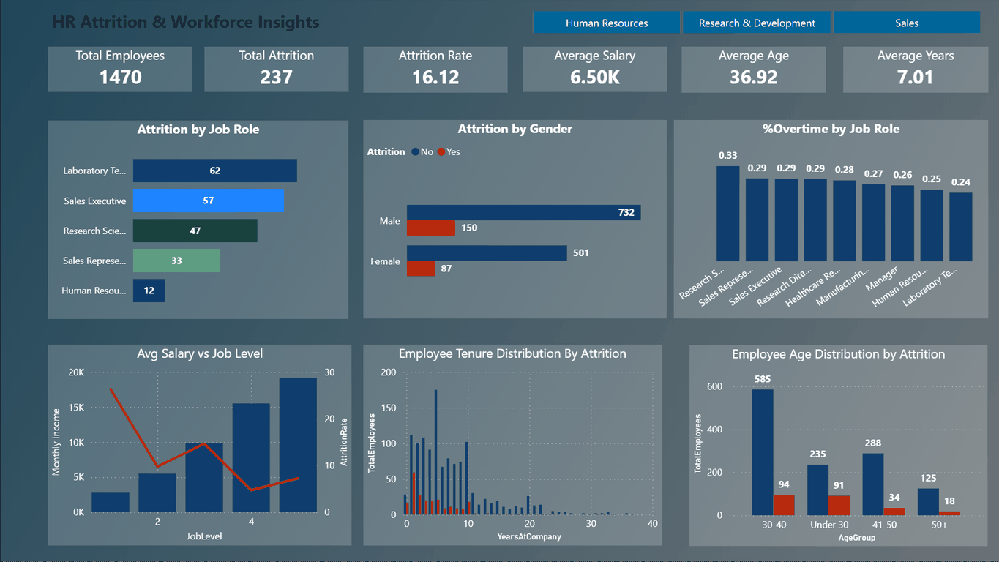

# HR Analytics Dashboard

[](#license)
[](#)

> An interactive Power BI dashboard analyzing employee attrition patterns across 1,470 employees to identify high-risk groups and recommend targeted retention strategies.

---

## 📊 Quick Links

- 🎬 [**Demo GIF**](assets/demo.gif) — 10-second walkthrough
- 📸 [**Screenshots**](#-demo--screenshots) — Full dashboard + department views
---

## 🎯 Project Overview

This project demonstrates end-to-end HR analytics using **Power BI**, focusing on employee attrition analysis to support data-driven retention strategies.

| Feature | Description |
|---------|-------------|
| **Tool** | Power BI Desktop |
| **Language** | DAX (Data Analysis Expressions) |
| **Dataset** | IBM HR Analytics Attrition Dataset (1,470 employees) |
| **Goal** | Identify patterns and key drivers behind employee attrition |
| **Techniques** | Data Modeling, DAX Measures, Calculated Columns, Bookmarks, Interactive Visualizations |

---

## 📂 Table of Contents

1. [Business Questions](#-business-questions)
2. [Dataset](#-dataset)
3. [Key Findings](#-key-findings)
4. [Per-Department Analysis](#-per-department-analysis)
5. [Technical Details](#-technical-details)
6. [Dashboard Layout](#-dashboard-layout)
7. [Demo & Screenshots](#-demo--screenshots)
8. [How to Reproduce](#-how-to-reproduce)
9. [Files & Assets](#-files--assets)
10. [License](#-license)

---

## ❓ Business Questions

This dashboard answers three critical HR questions:

1. **Where is attrition concentrated?** (department, job role, age, tenure)
2. **Which factors correlate with attrition?** (salary, overtime, job level)
3. **What targeted interventions would reduce attrition most efficiently?**

---

## 📊 Dataset

- **Source:** [IBM HR Analytics Attrition Dataset](https://www.kaggle.com/datasets/pavansubhasht/ibm-hr-analytics-attrition-dataset) (Kaggle)
- **Records:** 1,470 employees
- **Features:** 35 attributes (Age, Attrition, JobRole, Department, MonthlyIncome, YearsAtCompany, OverTime, JobLevel, Gender, etc.)
- **Attrition:** 237 employees left (16.12% overall rate)
- **Time Period:** Cross-sectional snapshot

---

## 🔍 Key Findings

### Overall Metrics (1,470 Employees Analyzed)

- **Total Attrition:** 237 employees (16.12%)
- **Average Monthly Income:** $6,503
- **Average Age:** 36.9 years
- **Average Tenure:** 7.0 years

### Critical Insights by Dimension

#### 1. 🎯 Attrition by Job Role (Highest-Risk Roles)

| Job Role | Attrition Count | Attrition Rate | Risk Level |
|----------|----------------|----------------|------------|
| **Sales Representatives** | 33 / 83 | **39.76%** | 🔴 Critical |
| **Laboratory Technicians** | 62 / 259 | **23.94%** | 🔴 Critical |
| **Human Resources** | 12 / 52 | 23.08% | 🟠 High |
| **Sales Executives** | 57 / 326 | 17.48% | 🟠 High |
| **Research Scientists** | 47 / 292 | 16.10% | 🟡 Moderate |

**Stable roles:** Managers (4.90%), Research Directors (2.50%)

#### 2. ⏰ Overtime Correlation (Most Critical Finding)

- **Overtime workers:** 30.53% attrition
- **Non-overtime workers:** 10.44% attrition
- **Risk multiplier:** 3x higher attrition for overtime employees

**Roles with highest overtime rates:**
- Research Scientists: 33.22%
- Sales Representatives: 28.92%
- Sales Executives: 28.83%

#### 3. 📅 Early-Tenure Attrition (0–2 Years is Critical)

| Tenure | Attrition Rate |
|--------|----------------|
| 0–2 years | **28.86%** |
| 3–5 years | 13.82% |
| 6–10 years | 12.28% |
| 10+ years | 8.13% |

**Key insight:** Attrition drops by 52% after year 2 — onboarding is critical.

#### 4. 👥 Age Demographics

| Age Group | Attrition Rate |
|-----------|----------------|
| 18–25 | **34.78%** |
| 26–30 | **21.29%** |
| 31–40 | 13.73% |
| 41–50 | 10.56% |
| 51+ | 12.59% |

#### 5. 💰 Job Level & Compensation (Inverse Correlation)

| Job Level | Avg Monthly Salary | Attrition Rate |
|-----------|-------------------|----------------|
| Level 1 (Entry) | $2,787 | **26.34%** |
| Level 2 | $5,502 | 9.74% |
| Level 3 | $9,817 | 14.68% |
| Level 4 | $15,504 | **4.72%** |
| Level 5 (Executive) | $19,192 | 7.25% |

**Clear inverse relationship:** Higher compensation = lower attrition

#### 6. 👫 Gender Analysis

| Gender | Attrition Rate |
|--------|----------------|
| Male | 17.01% (150 / 882) |
| Female | 14.80% (87 / 588) |

---

## 🏢 Per-Department Analysis

### Human Resources (63 employees)

- **Attrition:** 12 employees (19.05% — above company average)
- **Avg Monthly Income:** $6,654.51
- **% Working Overtime:** 26.98%

**⚠️ Critical Issue:** 46.15% early-tenure attrition (0–2 years) — highest across all departments

**Recommendations:**
- Implement structured 90-day onboarding with assigned mentors
- Conduct pulse surveys at 30/60/90/180 days
- Review overtime patterns and workload distribution
- Create clear career advancement paths within HR

---

### Research & Development (961 employees — 65% of workforce)

- **Attrition:** 133 employees (13.84% — below company average)
- **Avg Monthly Income:** $6,281.25 (lowest across departments)
- **% Working Overtime:** 28.20%

**⚠️ High-Risk Roles:**
- **Laboratory Technicians:** 62 departures (23.94% rate)
- **Research Scientists:** 47 departures (16.10% rate) + 33.22% work OT

**Recommendations:**
- Laboratory Technician retention program (salary benchmarking, career paths)
- Overtime intervention for Research Scientists (capacity planning, flexible work)
- Early-career mentorship program (0–2 years)
- Compensation review (lowest departmental average)

---

### Sales (446 employees — 30% of workforce)

- **Attrition:** 92 employees (20.63% — highest across all departments)
- **Avg Monthly Income:** $6,959.17 (highest across departments)
- **% Working Overtime:** 28.70%

**🚨 CRISIS ALERT:**
- **Sales Representatives:** 39.76% attrition (33 of 83) — nearly 40% turnover
- **Sales Executives:** 57 departures (17.48% rate)

**Paradox:** Highest salary + highest attrition = non-compensation issues

**Recommendations:**
- Emergency intervention for Sales Reps (quota review, comp restructure, extended onboarding)
- Root cause analysis via focus groups and exit interviews
- Review territory assignments and quota-setting process
- Enhance onboarding (30 → 90 days) with shadowing program
- Investigate morale, manager quality, and recognition programs

---

### Cross-Department Strategic Recommendations

1. **Onboarding Overhaul:** Structured 90-day program with mentors and check-ins
2. **Overtime Policy Reform:** Cap hours, hire additional staff in high-OT roles
3. **Compensation Benchmarking:** Adjust entry-level pay (Job Level 1: 26% attrition)
4. **Role-Specific Interventions:** Sales Reps (40%), Lab Techs (24%), HR early-tenure (46%)
5. **Manager Training:** Coaching, career conversations, stay interviews

---

## 🛠️ Technical Details

### Data Model
- Single fact table `HR_Data` with 35 denormalized attributes
- Power Query transformations for data cleaning and binning

### 🔹 Calculated Columns

| Name | Formula | Purpose |
|------|---------|---------|
| **AttritionFlag** | `IF(HR_Data[Attrition] = "Yes", 1, 0)` | Binary flag for attrition |
| **OvertimeFlag** | `IF(HR_Data[OverTime] = "Yes", 1, 0)` | Binary flag for overtime |
| **AgeGroup** | `SWITCH(TRUE(), HR_Data[Age] < 30, "Under 30", ...)` | Categorizes by age bracket |
| **TenureCategory** | `SWITCH(TRUE(), HR_Data[YearsAtCompany] <= 3, "Junior", ...)` | Categorizes by tenure |
| **IncomeBracket** | `SWITCH(TRUE(), HR_Data[MonthlyIncome] <= 4000, "Low", ...)` | Classifies by income level |
| **Job Level Label** | `SWITCH(HR_Data[JobLevel], 1, "Entry Level", ...)` | Converts numeric to text |

### 🔹 DAX Measures

| Name | Formula | Purpose |
|------|---------|---------|
| **Total Employees** | `COUNTROWS(HR_Data)` | Total headcount |
| **Total Attrition** | `CALCULATE(COUNTROWS(HR_Data), HR_Data[Attrition] = "Yes")` | Count of departures |
| **Attrition Rate %** | `DIVIDE([TotalAttrition], [TotalEmployees], 0) * 100` | Attrition percentage |
| **Avg Monthly Income** | `AVERAGE(HR_Data[MonthlyIncome])` | Average salary |
| **% OverTime** | `DIVIDE(CALCULATE(COUNTROWS(...), HR_Data[OverTime] = "Yes"), COUNTROWS(...), 0) * 100` | Overtime percentage |
| **Attrition Rate by Job Level %** | `VAR TotalByLevel = CALCULATE(..., REMOVEFILTERS(...)) ...` | Context-aware attrition rate |

### Design Decisions

- **DIVIDE for error handling:** Prevents divide-by-zero errors
- **Calculated columns in Power Query:** Consistent grouping across visuals
- **Bookmarks + buttons:** Single-page navigation for department views
- **REMOVEFILTERS for context-aware measures:** Show unfiltered comparisons when needed
- **SELECTEDVALUE for dynamic titles:** Page titles update based on selections

---

## 🗺️ Dashboard Layout

| Section | Visual Type | X-Axis | Y-Axis | Insight |
|---------|-------------|--------|--------|---------|
| **Top KPIs** | Card visuals | – | Total Employees, Attrition, Rate, Avg Salary, Age, Tenure | Workforce health |
| **Middle Chart 1** | Bar chart | Job Role | Total Attrition | High-risk roles |
| **Middle Chart 2** | Donut chart | Gender | Total Attrition | Gender distribution |
| **Middle Chart 3** | Treemap | Job Role | % OverTime | Overtime by role |
| **Bottom Chart 1** | Combo (Column + Line) | Job Level | Avg Salary (bars), Attrition Rate (line) | Compensation vs attrition |
| **Bottom Chart 2** | Stacked column | Years at Company | Employee Count by Attrition | Tenure distribution |
| **Bottom Chart 3** | Stacked column | Age Group | Employee Count by Attrition | Age distribution |
| **Department Tabs** | Bookmarks + Buttons | – | – | Filter by HR / R&D / Sales |

---

## 🎬 Demo & Screenshots

### Demo GIF (10 seconds)
[](assets/demo.gif)

### Screenshots

| Department | Preview |
|------------|---------|
| **Full Dashboard** | [](assets/screenshot-full.png) |
| **Human Resources** | [](assets/screenshot-hr.png) |
| **Research & Development** | [](assets/screenshot-rnd.png) |
| **Sales** | [](assets/screenshot-sales.png) |

---

## 🔧 How to Reproduce

### Prerequisites
- Power BI Desktop (latest version)
- IBM HR Analytics dataset from [Kaggle](https://www.kaggle.com/datasets/pavansubhasht/ibm-hr-analytics-attrition-dataset)

### Steps

1. **Download the dataset** from Kaggle
2. **Open Power BI Desktop** and import `WA_Fn-UseC_-HR-Employee-Attrition.csv`
3. **Apply Power Query transformations:**
   - Change data types (Age, Income → Whole Number; Attrition, OverTime → Text)
   - Trim whitespace from text columns
   - Create calculated columns (AgeGroup, TenureCategory, AttritionFlag, etc.)
4. **Create DAX measures** (see [Technical Details](#-technical-details))
5. **Build visuals:**
   - Top row: 6 KPI cards
   - Middle: Bar chart (Job Role), Donut chart (Gender), Treemap (Overtime)
   - Bottom: Combo chart (Salary vs Level), Stacked columns (Tenure & Age)
6. **Add interactivity:**
   - Department slicer
   - Bookmarks for department tabs (HR, R&D, Sales)
   - Report tooltips and drillthrough pages (optional)


---

## 📁 Files & Assets

```
HR_atty/
├── assets/
│   ├── demo.gif                    # 10-second animated demo
│   ├── demo.mp4                    # Video demo
│   ├── screenshot-full.png         # Full dashboard view
│   ├── screenshot-hr.png           # HR department view
│   ├── screenshot-rnd.png          # R&D department view
│   ├── screenshot-sales.png        # Sales department view
│   └── hr_dashboard.pbix           # Power BI source file (via Git LFS)
├── data/
│   └── WA_Fn-UseC_-HR-Employee-Attrition.csv  # Dataset
└── README.md                        # Project documentation
```


## 📄 License

This project is licensed under the MIT License. See [LICENSE](LICENSE) for details.


---

## 🙏 Acknowledgments

- **Dataset:** IBM HR Analytics team via Kaggle
- **Tools:** Microsoft Power BI Desktop
- **Inspiration:** Real-world HR analytics challenges and retention strategy optimization

---

<div align="center">
  
  **⭐ If you found this project helpful, please consider giving it a star!**
  
  Made with ❤️ and ☕ by Nirajan Khadka
  
</div>
