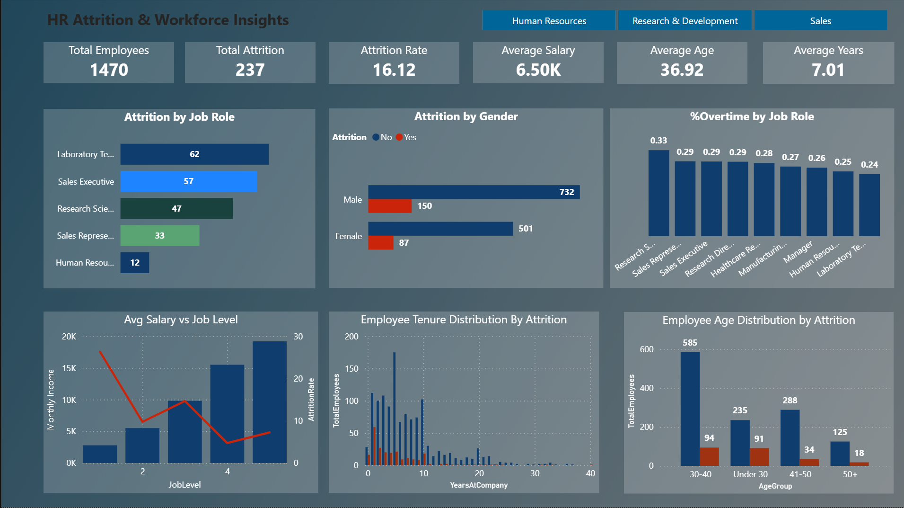
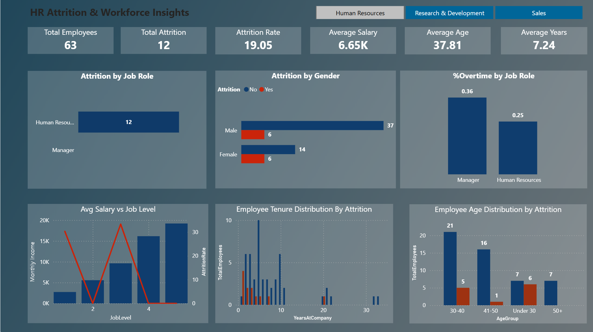
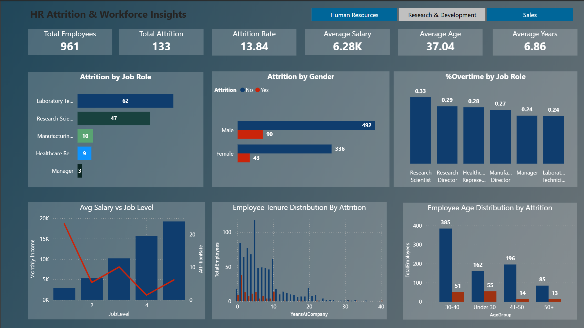
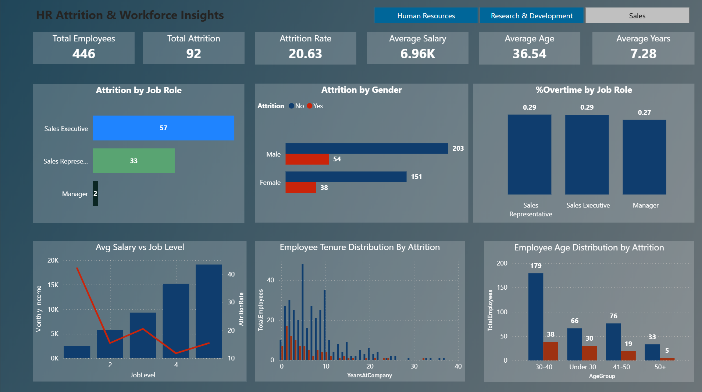

# 🏢 HR Analytics Dashboard — Power BI

[](#license)
[](#)

> An interactive Power BI dashboard analyzing employee attrition across **1,470 employees** to identify high-risk groups and recommend targeted retention strategies.

🎬 [Demo GIF](assets/demo.gif) &nbsp;|&nbsp; 📸 [Screenshots](#-demo--screenshots)

---

## Table of Contents
1. [Project Overview](#-project-overview)
2. [Business Questions](#-business-questions)
3. [Dataset](#-dataset)
4. [Key Findings](#-key-findings)
5. [Department Analysis](#-department-analysis)
6. [Technical Details](#-technical-details)
7. [Dashboard Layout](#-dashboard-layout)
8. [Demo & Screenshots](#-demo--screenshots)
9. [How to Reproduce](#-how-to-reproduce)
10. [Files & Assets](#-files--assets)

---

## 🎯 Project Overview

| Detail | Value |
|---|---|
| **Tool** | Power BI Desktop |
| **Language** | DAX (Data Analysis Expressions) |
| **Dataset** | IBM HR Analytics Attrition (1,470 employees) |
| **Goal** | Identify drivers of attrition and support retention decisions |
| **Techniques** | Data Modeling, DAX Measures, Calculated Columns, Bookmarks |

---

## ❓ Business Questions

1. **Where is attrition concentrated?** — by department, job role, age, and tenure
2. **Which factors correlate with attrition?** — salary, overtime, job level
3. **What interventions would reduce attrition most efficiently?**

---

## 📊 Dataset

- **Source:** [IBM HR Analytics Attrition Dataset](https://www.kaggle.com/datasets/pavansubhasht/ibm-hr-analytics-attrition-dataset) (Kaggle)
- **Records:** 1,470 employees · 35 features
- **Overall Attrition:** 237 employees left — **16.12% rate**

---

## 🔍 Key Findings

### Headline Metrics

| Metric | Value |
|---|---|
| Total Attrition | 237 employees (16.12%) |
| Avg Monthly Income | $6,503 |
| Avg Age | 36.9 years |
| Avg Tenure | 7.0 years |

### By Job Role

| Job Role | Attrition Count | Rate | Risk |
|---|---|---|---|
| Sales Representatives | 33 / 83 | **39.76%** | 🔴 Critical |
| Laboratory Technicians | 62 / 259 | **23.94%** | 🔴 Critical |
| Human Resources | 12 / 52 | 23.08% | 🟠 High |
| Sales Executives | 57 / 326 | 17.48% | 🟠 High |
| Research Scientists | 47 / 292 | 16.10% | 🟡 Moderate |
| Managers | — | 4.90% | 🟢 Stable |
| Research Directors | — | 2.50% | 🟢 Stable |

### Overtime — Most Critical Finding

- Overtime workers: **30.53%** attrition
- Non-overtime workers: **10.44%** attrition
- **3x higher risk** for employees working overtime

### Early-Tenure Attrition

| Tenure Band | Attrition Rate |
|---|---|
| 0–2 years | **28.86%** |
| 3–5 years | 13.82% |
| 6–10 years | 12.28% |
| 10+ years | 8.13% |

> Attrition drops **52% after year 2** — onboarding quality is the single biggest lever.

### Compensation vs Attrition

| Job Level | Avg Monthly Salary | Attrition Rate |
|---|---|---|
| Level 1 (Entry) | $2,787 | **26.34%** |
| Level 2 | $5,502 | 9.74% |
| Level 3 | $9,817 | 14.68% |
| Level 4 | $15,504 | 4.72% |
| Level 5 (Executive) | $19,192 | 7.25% |

---

## 🏢 Department Analysis

### Human Resources (63 employees)
- Attrition: 12 employees — **19.05%** (above average)
- ⚠️ **46.15% early-tenure attrition (0–2 years)** — highest of all departments
- **Actions:** 90-day structured onboarding, pulse surveys, clear career paths

### Research & Development (961 employees — 65% of workforce)
- Attrition: 133 employees — **13.84%** (below average)
- ⚠️ Lab Technicians: 23.94% · Research Scientists: 16.10% + 33.22% work OT
- **Actions:** Lab Tech salary benchmarking, OT intervention, early-career mentorship

### Sales (446 employees — 30% of workforce)
- Attrition: 92 employees — **20.63%** (highest department)
- 🚨 Sales Reps: **39.76%** — nearly 40% turnover despite highest avg salary ($6,959)
- **Paradox:** Highest pay + highest attrition = non-compensation root causes
- **Actions:** Emergency quota/comp review, exit interviews, 90-day onboarding with shadowing

### Cross-Department Priorities
1. **Onboarding overhaul** — 90-day program with assigned mentors
2. **Overtime reform** — cap hours, add headcount in high-OT roles
3. **Entry-level comp review** — Level 1 at 26% attrition is unsustainable
4. **Manager training** — coaching, stay interviews, career conversations

---

## 🛠️ Technical Details

### Calculated Columns

| Column | Formula | Purpose |
|---|---|---|
| AttritionFlag | `IF(Attrition = "Yes", 1, 0)` | Binary flag |
| OvertimeFlag | `IF(OverTime = "Yes", 1, 0)` | Binary flag |
| AgeGroup | `SWITCH(TRUE(), Age < 30, "Under 30", ...)` | Age brackets |
| TenureCategory | `SWITCH(TRUE(), YearsAtCompany <= 3, "Junior", ...)` | Tenure brackets |
| IncomeBracket | `SWITCH(TRUE(), MonthlyIncome <= 4000, "Low", ...)` | Income tiers |
| Job Level Label | `SWITCH(JobLevel, 1, "Entry Level", ...)` | Readable labels |

### DAX Measures

| Measure | Formula |
|---|---|
| Total Employees | `COUNTROWS(HR_Data)` |
| Total Attrition | `CALCULATE(COUNTROWS(HR_Data), Attrition = "Yes")` |
| Attrition Rate % | `DIVIDE([TotalAttrition], [TotalEmployees]) * 100` |
| Avg Monthly Income | `AVERAGE(HR_Data[MonthlyIncome])` |
| % OverTime | `DIVIDE(CALCULATE(COUNTROWS(...), OverTime = "Yes"), COUNTROWS(...)) * 100` |

### Design Decisions
- `DIVIDE()` throughout — prevents divide-by-zero errors
- `REMOVEFILTERS` on context-aware measures — unfiltered comparisons
- `SELECTEDVALUE` — dynamic page titles that update on selection
- Bookmarks + buttons — single-page navigation for department drill-downs

---

## 🗺️ Dashboard Layout

| Row | Visual | Axes | Insight |
|---|---|---|---|
| Top | 6 KPI Cards | — | Headcount, attrition, income, age, tenure |
| Middle | Bar chart | Job Role vs Attrition | High-risk roles |
| Middle | Donut chart | Gender vs Attrition | Gender split |
| Middle | Treemap | Job Role vs % OT | Overtime hotspots |
| Bottom | Combo chart | Job Level vs Salary + Rate | Compensation vs attrition |
| Bottom | Stacked column | Tenure vs Count | Tenure distribution |
| Bottom | Stacked column | Age Group vs Count | Age distribution |
| Nav | Bookmark buttons | — | HR / R&D / Sales tabs |

---

## 🎬 Demo & Screenshots

| View | Preview |
|---|---|
| Full Dashboard | [](assets/screenshot-full.png) |
| Human Resources | [](assets/screenshot-hr.png) |
| Research & Development | [](assets/screenshot-rnd.png) |
| Sales | [](assets/screenshot-sales.png) |

---

## 🔧 How to Reproduce

1. Download the dataset from [Kaggle](https://www.kaggle.com/datasets/pavansubhasht/ibm-hr-analytics-attrition-dataset)
2. Open Power BI Desktop and import `WA_Fn-UseC_-HR-Employee-Attrition.csv`
3. In Power Query: fix data types, trim whitespace, create calculated columns
4. Add all DAX measures from the [Technical Details](#-technical-details) section
5. Build visuals as per the [Dashboard Layout](#-dashboard-layout) table
6. Add department bookmarks and button navigation for HR / R&D / Sales tabs

## 📁 Files & Assets

```plaintext
HR_atty/
├── assets/
│   ├── demo.gif                              # Animated walkthrough
│   ├── demo.mp4                              # Video demo
│   ├── screenshot-full.png                   # Full dashboard
│   ├── screenshot-hr.png                     # HR department view
│   ├── screenshot-rnd.png                    # R&D department view
│   ├── screenshot-sales.png                  # Sales department view
│   └── hr_dashboard.pbix                     # Power BI file (Git LFS)
├── data/
│   └── WA_Fn-UseC_-HR-Employee-Attrition.csv
└── README.md
```
## 📄 License

MIT License — see [LICENSE](LICENSE) for details.

---

<div align="center">

Made with ❤️ by **Nirajan Khadka**

⭐ Star this repo if you found it useful!

</div>